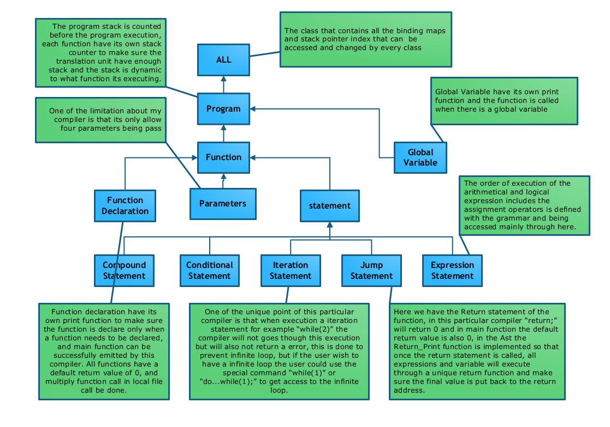

Documentation
=============

In total the documentation burden is (at most) 1000 words
plus one diagram. Assesment of the documentation is not relative
to compiler functionality, it just requires a description
of the compiler as-is, and a realistic assessment of the
compiler's strengths and weaknesses.

AST
===

Overview Diagram
----------------

_Add a diagram of your AST, which is designed to *usefully* communicate
the *important* properties of the AST._

- _Use whatever level of detail you feel is appropriate_.

- _You do not need to include every part of the AST, and you
  don't need to include every class_.

- _Zooming should not be necessary to understand it_.

The file should be called `my-ast.png`. The software used
to generate the png is up to you, or you can draw it by hand
and scan it if you wish (though beware the eventual file-size).

Description
-----------

_Describe the structure and organisation of your AST in 200 words
or fewer_.

- _Feel free to refer to your diagram_.

- _Try to capture the most important properties_.

- _You can use code, but it is included in your budget_.

Strengths
---------

_Give two strengths or capabilites of your AST, using 50 words or less for each one_.

### Strength 1

<!-- My AST is using a abstruct class structure which have a top-level class to define a common protocol for all class, which simplify and also defined the structure of all subclasses, and also sit on top of the top-level class there is another class which defines all the variable like the index of stack pointer,and avoided the global variable method.  

The purpose of an abstract class is to define a common protocol for a set of concrete subclasses. This is useful when defining objects that share code, abstract ideas, etc. -->

My AST uses a abstract class structure which the top-level class defines a commom protocol for all class to simplify the complexicity, and the top-level class inheratce from a class which defines all the variables for example the index of the stack, this is to avoid using global variables that might leads to implicit coupling issues.

### Strength 2

The AST of my compiler is leaded by the defined grammar, and have different codeprint function for each individual case rather than one print function which multiply if statements, the codeprint function is defined as virtual function in the top-level so the subclasses could override some certain behavior rather than implement one function in each class, each print function is called during different situation to avoid miss understanding.

<!-- You use virtual functions when you want to override a certain behavior (read method) for your derived class rather than the one implemented for the base class and you want to do so at run-time through a pointer to the base class.

The classic example is when you have a base class called Shape and concrete shapes (classes) that derive from it. Each concrete class overrides (implements a virtual method) called Draw().

You use virtual functions when you need handle different objects in the same way. Its called polymorphism. Let's imagine you have some base class - something like classical Shape: -->

Limitations
-----------

_Give two limitations of your AST, using 50 words or less for each one_.

### Limitation 1

The AST have a class sit on top of the base class to define variables that could be accessed by each calss to avoid using global variables, but in this case for this method to be truly global, a class pointer need to be declared in the main cpp file and all the print function need to have that pointer specified before exexcuting the function.

### Limitation 2

Using more than one print function is used during the code generation phase, it simplify the complexicity of one single print function however sometimes it leads to duplication of the same precedure in one function and more classes is needed to call the different printing functions in different situation.  

Variable binding
================

General approach
----------------

_Describe your overall approach to mapping variable, parameters, etc.
into registers or memory locations at exection time, using 200 words
or less_.

- _how did you manage registers?_
- _did you use the stack?_
- _is there a function or API for managing and looking up bindings?_

In this particular compiler each register serve its own properse, except the already defined register like $2 for arithmetic return value and $4-7 to store the parameters of a function, $t0 is use to be the temporay register to store the result of arithmetic value, and $t1 is used to store the calculated value in expression statement.

Other registers like $t3 and $t4 is used when logical-and expression and logical-or expression is being calculated to avoid overwrite of registers, there is no need to use more registers since all the information is pushed to the stack.

The stack is calculated before the execution to make sure enough stack is reserved for the calculation, the frame pointer is not used in this specific API, my compiler used to use dynamic stack that the stack is growing which exexcuting more statement but it not as stable as the method is beening used now.

Two binding maps is used in this API, and they share the same stack, the first binding map is used to bind the variable name and its specified stack index, another binding map is used to bind the calculated number when doing multiple assignment expression or arithmetic expression, for example in "x = 10 * 10 - 9 * 9" the two multiplcative expression is calculated first and pushed to the stack with its own lable, then the equation become " x = label1 - label2 " then the compiler pick the information from those labels according to the binding map and execute the next addictive expression, then finally the information in x is rewrited to the according to the most recent calculation.

when encounter a global variable the binding with bind the id of the globalvariable and a specified flag in this case "-2", and also when encounter a function declaration the binding map will bind the function to its own flag in this case "-3", when expression enounter a stack index of "-2" it will understand that it is not a local variable but a global variable and execute it correctely.

//Register t0 is the register used to put the return value in.
//Register t1 is the register used to put the calculated value after int x = ? or x  = ?

Strengths
---------

_Give two strengths or capabilites of your binding approach, using 50 words or less for each one_.

### Strength 1

The binding map of variable uses one binding to bind all declaration, that includes function declaration, global variable declaration and local variable, local varibale will have its own stack index and global variable have a flag of "-2" and function declaration have a flag of "-3" so that expression know what type of information its handling during execution.

### Strength 2

Another binding map of calculation is used to save registers, compare to stack we have very limited register and specifically temporay registers, when exexcuting a complexed assignment expression the higher level pioroaty expression will be calculated first and store back to stack, and the position of the stack is then stored in the binding map with its own label to avoid conflicts with the varibale.

Limitations
-----------

_Give two limitations of your binding approach, using 50 words or less for each one_.

### Limitation 1

Becasue there is only one binding map for all three types of declaration, there is a posibility of rewrite if for example declare a global variable called "x" first then declare it again as a local variable.  

### Limitation 2

Binding map for calculation is good for huge calculation but is slower compare to using all the avilible registers.

Reflection
==========

Strengths
---------

_What two aspects of your compiler do you think work well (beyond
those identified in the AST and binding parts)?_

### Strength 1

I think my compiler works really will with big calculation since it uses a binding map just for arithmetic calculation, when the calculation is big enough that you have to push some of the information to the stack then my API start to show better profermence compare to other compiler.

### Strength 2

My compiler also save registers really will since all the inforamation have its own copy in the stack, so only 3 or 4 registers is needed to do alll the calculation, when big program that requires alot of resouces and registers, if there is only one or two registers left, the compiler would still work since it only reqires a small amount of register resoureces.

Scope for Improvment
---------------------

_What parts of your compiler do you think could be improved?_

- _This is not looking for things like "It should support more C constructs". What
  would you need to do or change in order to support those things?_

### Improvement 1

I think the binding method of my compiler could be improved, now everything with the same name can only be decalred once and only once, if define global variable "x" or function "x", there cannot be any local variable with the same name inside any scope. Thus it could really be improved by using more binding map or set condition with label to sepreates them.

### Improvement 2

I also think the code generation printing function and local varibale decalration of my compiler could be improved, now I am using multiply print function to sepreates each case of declaration when it needed, but it increse the class size and sometimes leads to dupilications, also local varibale with the scope could be improved since now the compiler does not understand the varibale is different within the scope of a compound statement and inside of compound statement. 

_50 words or fewer_

Functionality (not assessed)
============================

Which of these features does your compiler support (insert
an `x` to check a box):

1 - [x] Local variables
2 - [x] Integer arithmetic
3 - [x] While
4 - [x] IfElse
5 - [x] For
6 - [x] Function calls
7 - [ ] Arrays
8 - [ ] Pointers
9 - [ ] Strings
10 - [ ] Structures
11 - [ ] Floating-point

Note that all features will be tested, regardless of what
appears here. This is documentation of what you expect to work,
versus what doesn't work.

Feedback (not assessed)
=======================

_What aspects of your compiler would you like feedback on.
Be specific, as "what could I have done differently" is
too general to answer._

### Feedback 1

_20 words or fewer_

### Feedback 2

_20 words or fewer_
